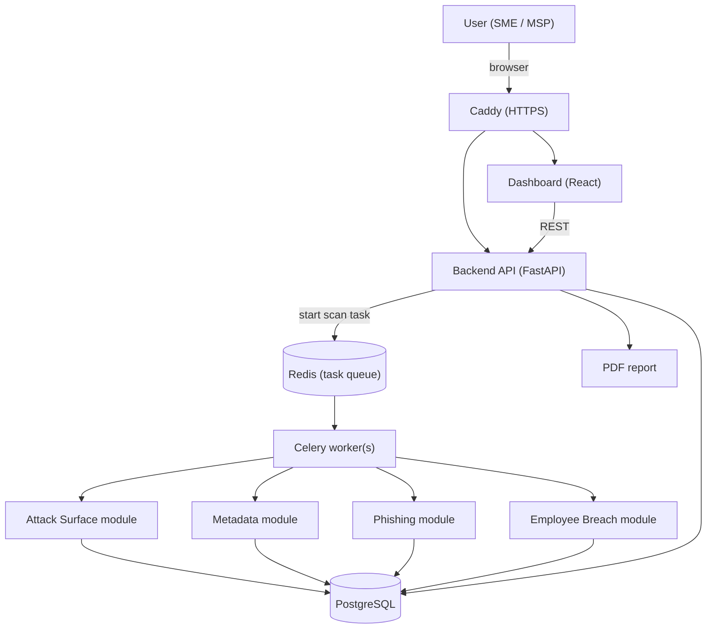

# 3. Architecture

## 3.1 Overview

QN-Sentry consists of independent scanner modules, a central backend and a web dashboard, all running as Docker containers orchestrated with Docker Compose. Scans are long-running (typically 10–30 minutes), so the backend does not execute them itself: it places a scan task in a Redis queue, and separate Celery workers pick it up and run the modules. Every module writes its results in a common *finding* format to a central PostgreSQL database, from which the dashboard and the PDF report are generated.

## 3.2 Scan Flow

1. The user creates a client and its domain(s) in the dashboard; an administrator approves the domain on the allowlist.
2. The user starts an assessment; the API stores a new scan record and places a task in the Redis queue.
3. A Celery worker picks up the task and runs the four OSINT modules.
4. Each module writes its findings to PostgreSQL in the common finding format; the dashboard shows the progress per module.
5. When all modules are finished, the risk score is calculated and the PDF report can be generated.

## 3.3 Technology Stack

| Component | Technology | Motivation |
|---|---|---|
| Backend API | Python + FastAPI (REST) | Same language as the scanner modules; automatic API documentation |
| Scanner modules | Python (wrappers around the OSINT tools via `subprocess`, parsing their JSON output) | Consistent with backend and task queue; robust error handling |
| Dashboard | React | Modern, interactive single-page interface; runs as a separate container |
| Database | PostgreSQL | Structured storage of clients, scans and findings |
| Task queue | Celery + Redis | Long-running scans run asynchronously on separate workers; scalable; enables future scheduled scanning (by adding Celery Beat) |
| Reverse proxy | Caddy | Automatic HTTPS; routes traffic to dashboard and API |
| Deployment | Docker Compose | All components as containers; reproducible environment |
| Install and setup scripts | Bash | Standard on Linux servers; no dependencies |

## 3.4 OSINT Tools per Module

| Module | Tools |
|---|---|
| Attack Surface Mapping | subfinder (subdomains), dnsx (DNS resolution and wordlist brute-forcing), naabu (fast port discovery), Nmap `-sV` (service and version detection on discovered ports), httpx (web services and technologies) |
| Document Metadata Analysis | katana (crawler), exiftool (metadata extraction) |
| Phishing Domain Detection | dnstwist (lookalike domains), crt.sh (Certificate Transparency search), DNS lookups of SPF, DMARC and DKIM records (dnspython) |
| Employee Breach Exposure | Have I Been Pwned API, local test dataset |
